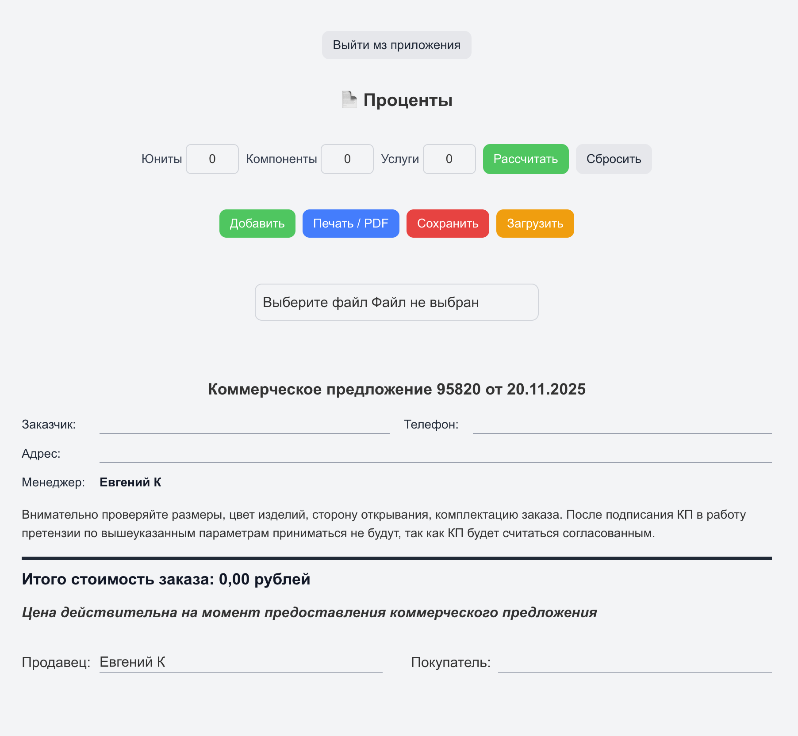
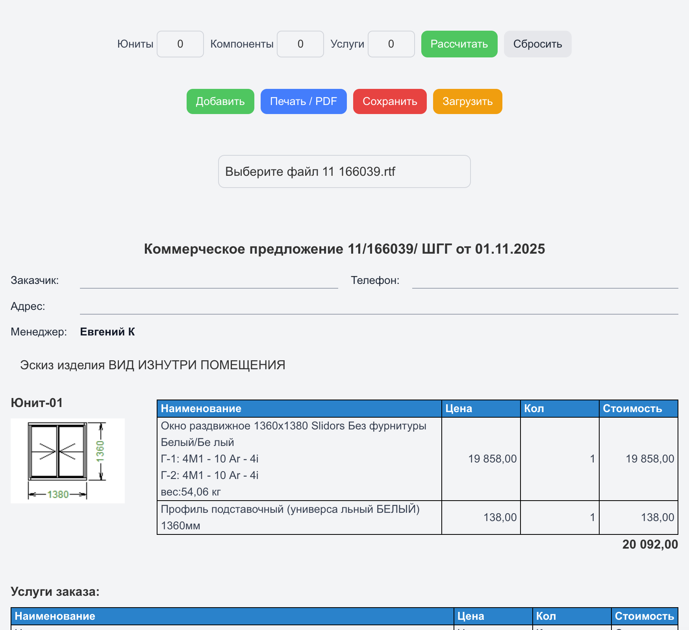
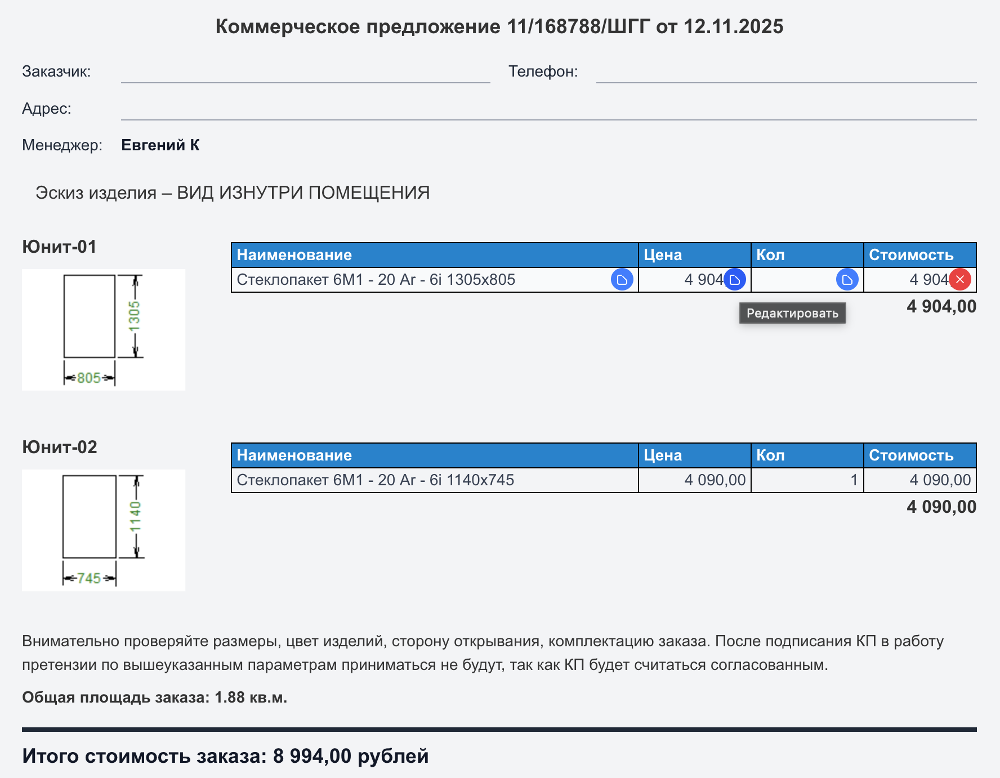
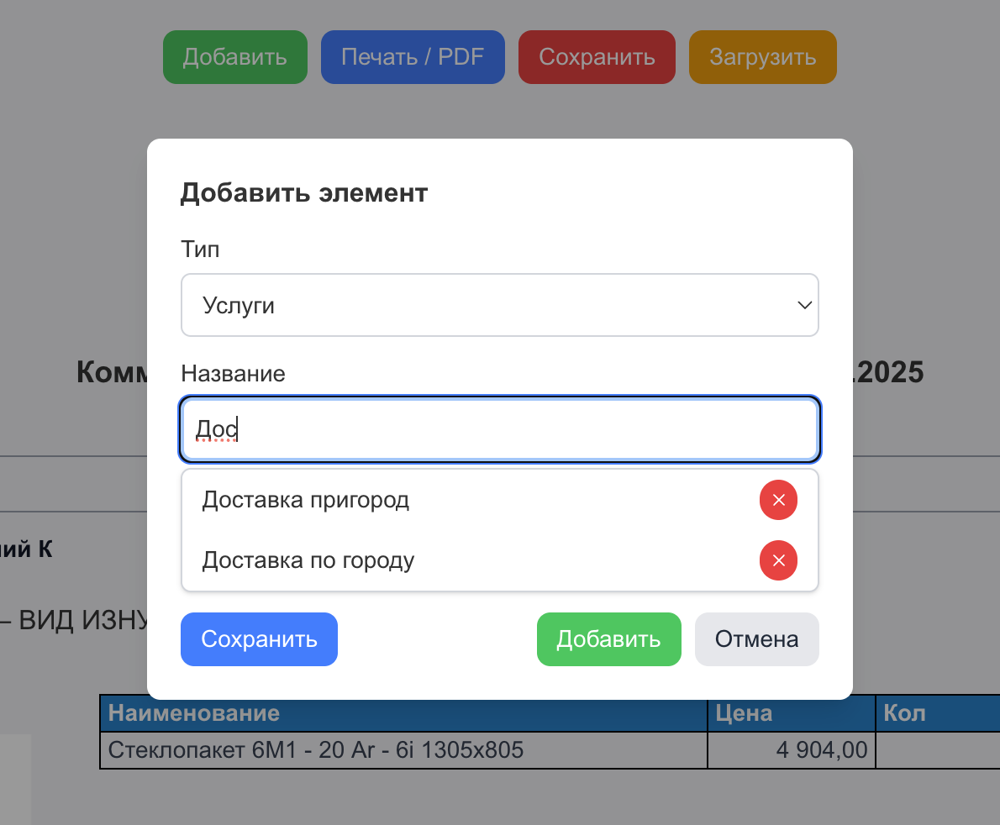
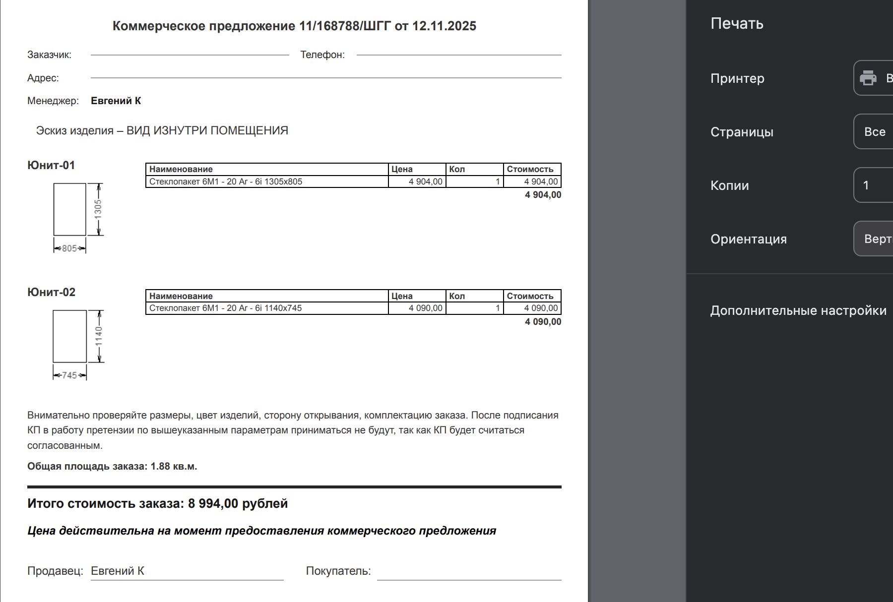

# Panorama



**Panorama** — веб-приложение для учёта заказов и формирования коммерческих предложений и счетов.

## Доступно онлайн

Приложение доступно по ссылке: [Panorama](https://panorana-2025.web.app/)

Логин/пароль предоставляю по запросу

Приложение позволяет:

- Парсить файлы .rtf определять в них картинки, колонки с информацией о товаре. Визуализировать в виде таблиц. Определять и рассчитывать стоимость товара и общую стоимость с учетом скидок.
- Легко управлять скидками отдельно на товар, комплектующие или услуги
- Вводить данные по заказчику, телефону, адресу
- Составлять заказы по юнитам, компонентам и услугам
- Создавать/Получать с сервера товар или услугу с ценой. Быстрый ввод с автокомплитом.
- Рассчитывать итоговую стоимость заказа
- Печать и экспорт заказов в PDF
- Сохранять и загружать данные заказов на сервер

---

## Функционал

- Расчёт стоимости заказа по выбранным компонентам и услугам
- Добавление, редактирование и удаление заказов
- Редактирование всех элементов заказа
- Формирование коммерческих предложений с указанием менеджера
- Экспорт в PDF
- Аутентификация пользователей через Firebase

---

## Технологии

- **Vue.js 3** (Composition API)
- **Pinia** — управление состоянием
- **Firebase Firestore** — база данных, хостинг
- **TailwindCSS / SCSS** — стили

---

## Скриншоты

### Главная страница



### Парсинг, отрисовка .rtf файла



### Создание заказа



### Просмотр и печать КП




---

## Установка и запуск локально

```bash
git clone https://github.com/USERNAME/panorama.git
cd panorama
npm install
```

## Настройка Firebase
Создай проект на Firebase

Скопируй конфигурацию и вставь в src/firebase/firebaseConfig.js

```bash
import { initializeApp } from "firebase/app";
import { getFirestore } from "firebase/firestore";
import { getAuth } from "firebase/auth";

const firebaseConfig = {
  apiKey: "...",
  authDomain: "...",
  projectId: "...",
  storageBucket: "...",
  messagingSenderId: "...",
  appId: "..."
};

const app = initializeApp(firebaseConfig);
const db = getFirestore(app);

const auth = getAuth(app)

export { db, auth };

```

## Деплой на Firebase Hosting
После деплоя приложение будет доступно по ссылке https://PROJECT_ID.web.app/.

```bash
npm install -g firebase-tools
firebase login
firebase init
firebase deploy
```